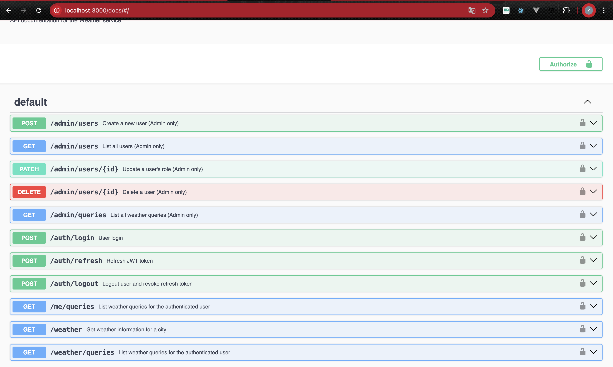
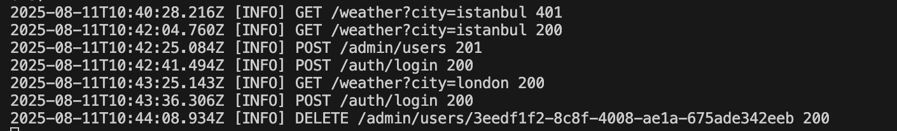
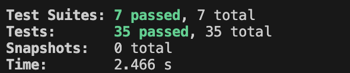
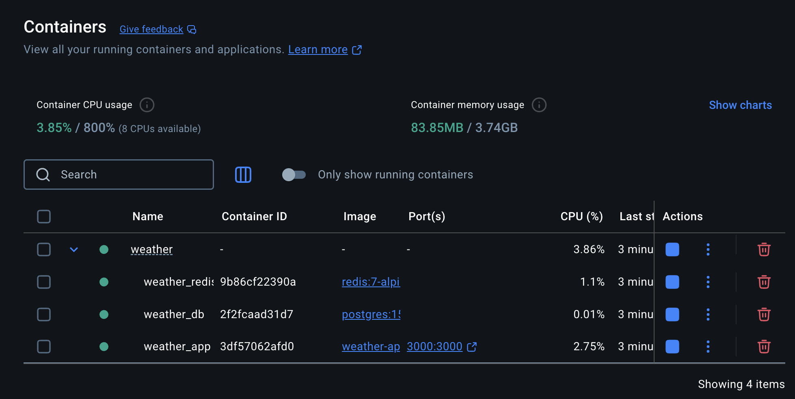

# Weather API

An Express/TypeScript API integrating OpenWeather, PostgreSQL (Prisma), Redis caching, JWT auth, Joi validation, Swagger docs, Winston logging, Sentry error tracking, rate limiting, Prometheus metrics, and CI/CD readiness.

## Architectural Decisions

- **Monolithic Express Structure**: Chosen for its simplicity and rapid development cycle, combining routing, middleware, and controllers in a single deployable service.
- **Service Layer Separation**: Controllers handle HTTP concerns (request parsing, response formatting), while Services encapsulate business logic and data access. This separation improves testability, maintainability, and clear responsibility boundaries.
- **Error Handling Strategy**: Centralized `ApiError` class and middleware capture synchronous and asynchronous errors, returning consistent HTTP error responses and logging details via Winston.

## Database Optimization Notes

- **Prisma Schema & Indexes**: Composite and single-field indexes added on `weatherQuery.userId`, `weatherQuery.createdAt`, and `user.email` to accelerate common lookup queries (e.g., fetching user-specific query history, ordering by creation date).
- **Normalization Decisions**: Data normalized with separate `User` and `WeatherQuery` tables to avoid duplication. Denormalization minimized to JSON-serialized `response` field in `WeatherQuery` for flexibility in storing external API payloads without schema changes.

## Prerequisites

- Node.js (>=14)
- pnpm (https://pnpm.io) for package management
- PostgreSQL database
- Redis server
- OpenWeather API key

## Project Structure

```bash
├── .env
├── .gitignore
├── pnpm-lock.yaml
├── README.md
├── package.json
├── tsconfig.json
├── jest.config.js
├── app.ts
├── server.ts
├── config/
│   └── config.ts
├── loaders/
│   ├── db.loader.ts
│   └── redis.loader.ts
├── middleware/
│   ├── asyncHandler.middleware.ts
│   ├── validation.middleware.ts
│   ├── error.middleware.ts
│   └── auth.middleware.ts
├── validators/
│   ├── weather.validator.ts
│   ├── auth.validator.ts
│   └── admin.validator.ts
├── controllers/
│   ├── auth.controller.ts
│   ├── user.controller.ts
│   ├── admin.controller.ts
│   └── weather.controller.ts
├── routes/
│   ├── auth.routes.ts
│   ├── user.routes.ts
│   ├── weather.routes.ts
│   └── admin.routes.ts
├── services/
│   ├── auth.service.ts
│   ├── weather.service.ts
│   ├── user.service.ts
│   └── admin.service.ts
├── models/
│   ├── user.model.ts
│   └── weather-query.model.ts
├── utils/
│   ├── logger.ts
│   └── ApiError.ts
├── __tests__/
│   ├── app.test.ts
│   ├── auth.test.ts
│   ├── authFlow.test.ts
│   ├── userFlow.test.ts
│   ├── admin.test.ts
│   ├── adminFlow.test.ts
│   └── weather.test.ts
├── prisma/
│   ├── migrations/
│   └── schema.prisma
└── images/
    ├── api_logs.png
    ├── tests.png
    ├── redis.png
    └── Swagger.png
```

## API Documentation

Swagger UI is available at:

```bash
http://localhost:3000/docs
```



## Features

- JWT Authentication (login, refresh, logout)
- Rate limiting with `express-rate-limit` 
- Input validation with Joi
- Redis caching with dynamic TTL and in-memory stub for tests 
- Prometheus metrics exposed at `/metrics`
- Centralized logging with Winston 
- Error monitoring with Sentry
- OpenAPI/Swagger documentation via `swagger-ui-express`

## Testing

Run the test suite:

```bash
pnpm test
```



## Setup

1. Clone the repository:
   ```bash
   git clone https://github.com/YavuzYilmazz/open_weather.git
   cd open_weather
   ```
2. Install dependencies:
   ```bash
   pnpm install
   ```
3. Copy and configure environment variables:

   ```bash
   cp .env.example .env
   # Edit .env with your settings:
   # DATABASE_URL, REDIS_URL, OPENWEATHER_API_KEY, JWT_SECRET, CACHE_TTL_SECONDS
   ```

   # Docker (Compose)

   If you have Docker and Docker Compose installed, you can spin up the database, cache, and app with:

   ```bash
   docker-compose up -d --build
   docker-compose ps
   docker-compose logs app --tail=20
   ```

   To tear down:

   ```bash
   docker-compose down
   ```

     <!-- Docker badge -->

   ### Docker Image

   

   You can also pull, build, and run the Docker image.

   ```bash
   # Pull the Docker image from Docker Hub
   docker pull YavuzYilmazz/open_weather:latest

   # Build the Docker image locally (if you haven't published)
   docker build -t open_weather:latest .

   # Run the image
   docker run -d -p 3000:3000 --env-file .env.example --name weather_app YavuzYilmazz/open_weather:latest
   ```

4. Run database migrations:
   ```bash
   npx prisma migrate dev
   ```

## Running

- Start server:
  ```bash
  pnpm exec ts-node server.ts
  ```
- Start in development mode with hot reload:
  ```bash
  pnpm exec tsx watch server.ts
  ```

Server listens on port defined in `.env` (default: 3000).

## Continuous Integration (CI) (optional)

- Optionally, this project includes a sample GitHub Actions workflow at `.github/workflows/ci.yml`.
- You can enable CI by copying or customizing this file to suit your needs.

The workflow performs the following steps:

1. Checks out the code.
2. Installs dependencies with `pnpm install`.
3. Runs type checking and linting.
4. Executes the test suite (`pnpm test`).
5. Builds the application (`pnpm run build`).
6. (Optional) Builds Docker images via `docker-compose build`.

- If your CI workflow includes database or Redis integration tests, you may configure the following environment variables (e.g., `DATABASE_URL`, `REDIS_URL`, `OPENWEATHER_API_KEY`, `JWT_SECRET`) as encrypted secrets in your repository settings. This is only required if your workflow executes integration tests.

## Endpoints

### Authentication

- **POST /auth/login**
  - Description: Authenticate user with email & password and receive access & refresh tokens.
  - Request Body: `{ email: string, password: string }`
  - Response: `{ token: string, refreshToken: string }`

- **POST /auth/refresh**
  - Description: Exchange a valid refresh token for a new access token.
  - Request Body: `{ refreshToken: string }`
  - Response: `{ token: string }`

- **POST /auth/logout**
  - Description: Revoke a refresh token to log out the user.
  - Request Body: `{ refreshToken: string }`

### Weather Queries

- **GET /weather?city={city}&units={units}**
  - Description: Retrieve current weather for a specified city (default units: metric).

- **GET /weather?lat={latitude}&lon={longitude}&units={units}**
  - Description: Retrieve current weather by geographic coordinates.

- **GET /weather/queries**
  - Description: List past weather queries made by the authenticated user.

### User Profile

- **GET /me/queries**
  - Description: Fetch the authenticated user’s weather query history.

### Admin Routes (ADMIN role required)

- **POST /admin/users**
  - Description: Create a new user with specified email, password, and role.

- **GET /admin/users**
  - Description: Retrieve a list of all users in the system.

- **PATCH /admin/users/:id**
  - Description: Update a user’s role by user ID.
  - Request Body: `{ role: "ADMIN" | "USER" }`

- **DELETE /admin/users/:id**
  - Description: Delete a user by user ID.

- **GET /admin/queries**
  - Description: List all weather queries across all users.
